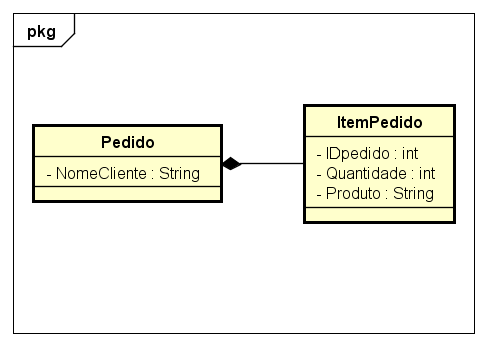

# Glossário POO
Glossário criado para trabalho da disciplina de Programação Orientada a Objetos do segundo ano do curso de Engenharia de Software da Univille.

Sumário
=====
- [Construtor](#construtor)
- [Instanciação](#instanciação)
- [Palavras Reservadas](#palavras-reservadas)
  - [new](#new)
  - [instanceof](#instanceof)
  - [public](#public)
  - [private](#private)
  - [final](#final)
  - [this](#this)
- [Encapsulamento](#encapsulamento)
- [Getters e Setters](#getters-e-setters)
- [Assinatura de método](#assinatura-de-método)
- [Sobrecarga de método](#sobrecarga-de-método)
- [Escopos](#escopos)
  - [Escopo de classe](#escopo-de-classe)
  - [Escopo de objeto](#escopo-de-objeto)
- [Relacionamentos](#relacionamentos)
  - [Relacionamento de Dependência](#relacionamento-de-dependência)
  - [Relacionamento de Agregação](#relacionamento-de-agregação)
  - [Relacionamento de Composição](#relacionamento-de-composição)

Construtor
=====
Construtores são métodos que não possuem indicação de retorno, e têm o mesmo nome da classe, sendo chamados apenas na hora da instanciação do objeto. No exemplo a seguir, é criado um método construtor dentro da classe Cachorro:
```java
public class Cachorro{
  public Cachorro(){
    public String cor;
    public String raca;
    }
  }
```
Instanciação
=====
É a criação de um objeto, utilizando sua classe, através do operador [new](#new)
```java
Cachorro Scooby = new Cachorro()
Scooby.cor = "Marrom";
Scooby.raca = "Dogue Alemão";
```

Palavras Reservadas
=====
new
-----
É um operador que aloca memória para um objeto, incializa variáveis, e chama um método construtor, como no [exemplo dado na instanciação do objeto](#instanciação)

instanceof
-----
Determina se um objeto é uma instância de uma classe, realizando uma comparação. No exemplo a seguir, é comparado se o objeto Scooby é uma instância de Cachorro. Caso seja, é impresso à tela que Scooby é um cão, caso não seja, é impresso que não é.
```java
if (Scooby instanceof Cachorro){
  System.out.println("É um cão.")
  }else{
  System.out.println("Não é um cão")
  }
```

public
-----
É um modificador de acesso, que faz com que a classe/método/variável possa ser acessado através de qualquer classe.

private
-----
Assim como o anterior, também é um modificador de acesso, mas que faz com que o método/variável só possa ser acessado pela sua própria classe.

this
-----
É uma variável de referência, utilizada para fazer definições em variáveis de uma instância específica de um objeto.

final
-----
Impossibilita de uma classe ser estendida, um método ser sobrescrito, ou uma variável ser alterada, tornando-a constante.

Encapsulamento
=====
Forma de esconder e proteger dados dentro de um método específico, de maneira que para acessá-los, deve ser apenas através de seu método.

Getters e Setters
=====
São métodos utilizados dentro de uma classe para acessar e alterar variáveis privadas dessa mesma classe.

Assinatura de Método
=====
Determina a identidade de um método, sendo composto por nome, tipo e quantidade de parâmetros, e tipo de retorno.

Sobrecarga de método
=====
Quando há diversos métodos com mesmo nome, porém de diferentes quantidades de parâmetros ou tipo de retorno, ou seja, com diferente assinatura exceto pelo nome.

Escopos
=====
Escopo de classe
-----
É o nome dado às limitações de uma variável. O escopo inicia no começo da classe, e termina ao final dela. Todas as variáveis declaradas dentro dessa classe só é válida dentro dela, podendo ser usada pelos métodos criados após sua declaração.

Escopo de objeto
-----
Define todos os atributos e métodos não estáticos, podendo ser alterados através de uma instância do objeto. Se algo não for estático, automaticamente é do escopo do objeto.

Relacionamentos
=====
Relacionamento de Dependência
-----
Ocorre quando uma classe precisa de outra para existir, e qualquer alteração na classe causa mudanças na outra que for dependente desta, como no exemplo UML a seguir. Qualquer alteração no lote, causará uma alteração na casa.


Relacionamento de Agregação
-----
Ocorre quando uma classe agrega outra, mas que caso uma classe seja excluída, a classe agregada pode continuar a existir sem problemas. No exemplo, um time possui jogadores, mas caso o time deixe de existir, os jogadores continuam existindo.


Relacionamento de Composição
-----
Ocorre quando uma classe é composta por outra, e não pode continuar existindo caso a classe composta seja excluída. No exemplo, vemos que um pedido é composto por itens de pedido, porém, se o item de pedido deixa de existir, o pedido não pode continuar existindo, e deve ser removido também.


